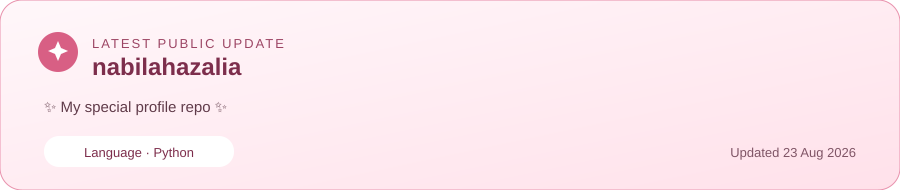

Idol-inspired profile · Not JKT48 ex member

## About me

Hi, I'm Nabilah. I'm learning how to build for the web and using this profile to share the journey as it grows.

Right now, I'm practicing the basics, getting more comfortable with Git and GitHub, and exploring small automations for this profile.

## Current setlist

- Learn HTML and CSS fundamentals
- Practice JavaScript and Python through small experiments
- Get comfortable with Git, GitHub, and simple GitHub Actions workflows
- Add real projects here as they are ready to share

## Learning and exploring

`HTML` · `CSS` · `JavaScript` · `Python` · `Git` · `GitHub Actions`

These are technologies I'm learning or exploring—not a proficiency rating.

## Current activity

This card uses public GitHub data and refreshes weekly. Empty popularity metrics are intentionally left out.

## Follow along

[Follow me on GitHub](https://github.com/nabilahazalia) to see what I learn and build next.

✦ Every new skill starts with a first rehearsal. ✦

