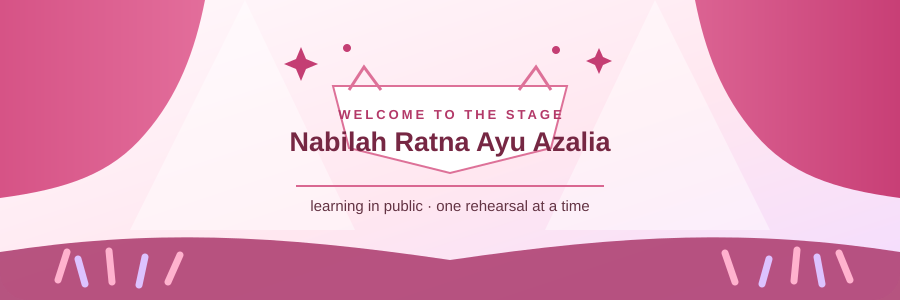
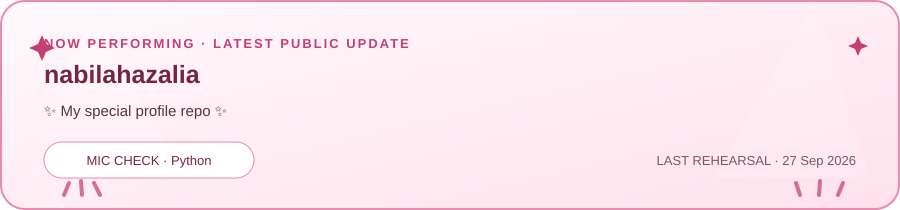

<picture>
  <source media="(prefers-color-scheme: dark)" srcset="./assets/idol-stage-dark.svg">
  <source media="(prefers-color-scheme: light)" srcset="./assets/idol-stage-light.svg">
  
</picture>

♡ Idol-inspired learning profile · Not JKT48 ex member ♡

## 🎀 Profile

Hi, I'm Nabilah. I'm learning how to build for the web and sharing the journey as it grows—one rehearsal, experiment, and small win at a time.

Right now, I'm practicing the basics, getting more comfortable with Git and GitHub, and exploring small automations for this profile.

## 🎤 Current setlist

- Learn HTML and CSS fundamentals
- Practice JavaScript and Python through small experiments
- Get comfortable with Git, GitHub, and simple GitHub Actions workflows
- Add real projects here as they are ready to share

## ✨ Backstage practice

`HTML` · `CSS` · `JavaScript` · `Python` · `Git` · `GitHub Actions`

These are technologies I'm learning or exploring—not a proficiency rating.

## 🌟 On stage now

<picture>
  <source media="(prefers-color-scheme: dark)" srcset="./assets/current-activity-dark.svg">
  <source media="(prefers-color-scheme: light)" srcset="./assets/current-activity-light.svg">
  
</picture>

This card uses public GitHub data and refreshes weekly. Empty popularity metrics are intentionally left out.

## 💌 Encore

[Follow me on GitHub](https://github.com/nabilahazalia) to see what I learn and build next.

♡ The stage is small today, but every new skill begins with a first rehearsal. ♡

