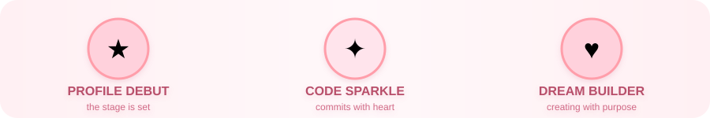

<div align="center">


<a href="https://git.io/typing-svg"></a>


<sub>Idol-inspired developer profile · Not JKT48 ex member</sub>

</div>

---

<div align="center">

### 🎀 ｡･ﾟﾟ･ 𝓐𝓫𝓸𝓾𝓽 𝓜𝓮 ･ﾟﾟ･｡ 🎀

</div>

```yaml
stage_name: Nabilah Ratna Ayu Azalia
fandom_name: Code Lovers 💕
position: Full-Stack Dreamer 🌟
catchphrase: "Code with passion, shine with purpose!"
skills_training:
  - 💻 Coding choreography (clean commits only!)
  - 🎨 Designing pastel-perfect UIs
  - ☕ Caffeine-to-code conversion (100% efficiency)
hobbies: [ "🎧 music", "📚 learning new tech", "🌸 daydreaming", "✨ sparkling" ]
```

<div align="center">

### 🎤 ｡･ﾟﾟ･ 𝓜𝔂 𝓢𝓽𝓪𝓰𝓮 𝓖𝓮𝓪𝓻 ･ﾟﾟ･｡ 🎤


</div>

<div align="center">

### 🏆 ｡･ﾟﾟ･ 𝓣𝓻𝓸𝓹𝓱𝔂 𝓡𝓸𝓸𝓶 ･ﾟﾟ･｡ 🏆



</div>

<div align="center">

### 📊 ｡･ﾟﾟ･ 𝓟𝓮𝓻𝓯𝓸𝓻𝓶𝓪𝓷𝓬𝓮 𝓢𝓽𝓪𝓽𝓼 ･ﾟﾟ･｡ 📊


</div>

<div align="center">

### 💌 ｡･ﾟﾟ･ 𝓕𝓪𝓷 𝓛𝓮𝓽𝓽𝓮𝓻𝓼 ･ﾟﾟ･｡ 💌

*Want to collab or just say hi? My inbox is always open for lovely people!* 🌷

<a href="https://github.com/nabilahazalia"></a>

</div>

<div align="center">

🌸｡･ﾟﾟ･｡･ﾟﾟ･｡ 🎀 ｡･ﾟﾟ･｡･ﾟﾟ･｡ 🌸

*“Every commit is a step toward the spotlight.”* ✨

🌸｡･ﾟﾟ･｡･ﾟﾟ･｡ 🎀 ｡･ﾟﾟ･｡･ﾟﾟ･｡ 🌸

</div>


